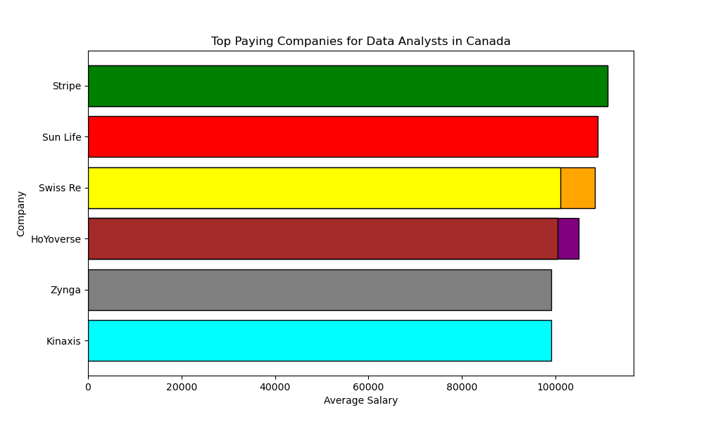
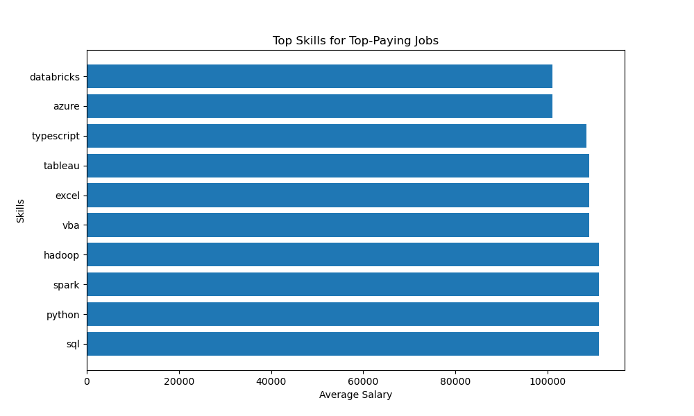
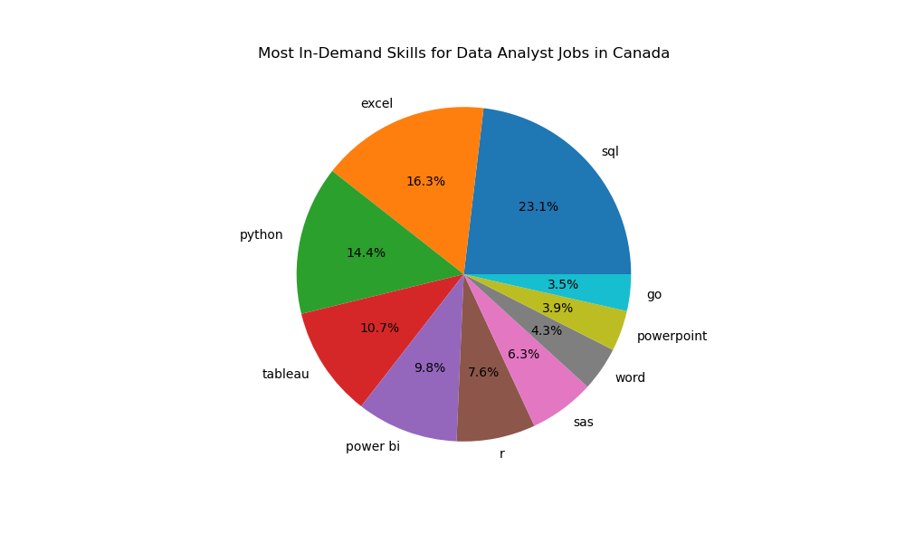
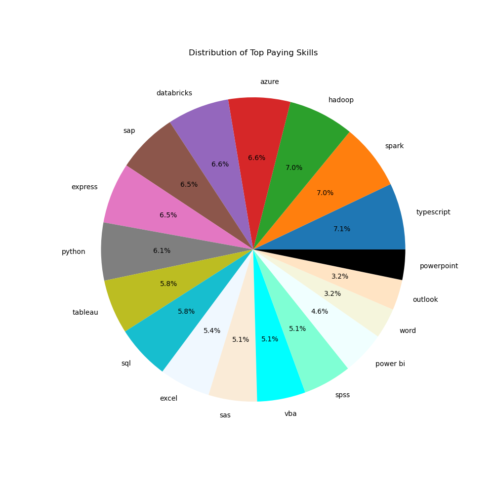
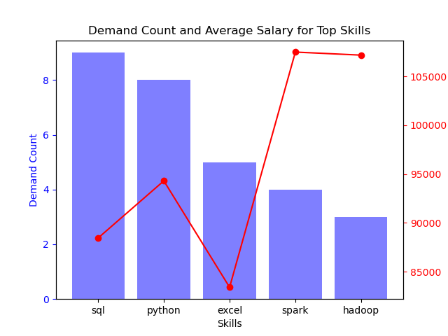

# Data Analyst Job Market Analysis with SQL

## Introduction

This is a small data analysis project about top-paying jobs, in-demand skills, and optimal skills to learn in the field of data analytics. My focus was on the role of 'Data Analyst', but same implementations can be applied to other roles such as 'Data Engineer', 'Data Scientist' and 'Business Analyst' as well.

**SQL queries?** Check them out here: [project_sql_folder](/project_sql/)</br>
**Python scripts and charts?** Check them out here: [project_sql_folder](/project_python/)

## Background

To practice and showcase my foundation of SQL, I decide to take on this simple project.

The data is taken from Luke Barousse [SQL Course](https://lukebarousse.com/sql). It includes 4 tables packs information about job titles, salaries, locations, and essential skills in the field of data analytics.

### The questions I wanted to answer through my sql queries are

    1. What are the top paying jobs for my role? Note:you can pick a role that you like. 
    2. What are the skills required for these top-paying roles? 
    3. What are the most in-demand skills for my role?
    4. What are the top skills base on salary for my role?
    5. What are the most optimal skills to learn? 
        optimal: high demand and high paying

## Tools I used

- SQL: the most important one, through it I was able to query the database, and find critical insights.
- PostgresSQL: since I am using local machine to analyze data, it was my chosen database management system. There are four main tables stored inside:
  - **job_posting_fact**: the main table that contains information as the job titles, job locations, yearly average salary, etc.
  - **company_dim**: details about the companies, such as company name, company link, etc.
  - **skills_dim**: this table is a dimension table which includes skill id, skills name and type.
  - **skills_job_dim**: it is a bridge table that links the job_posting_fact and skills_dim table.

- Python: to gain better insight, I used python's `Pandas` for data cleaning and manipulation and `Matplotlib` for visualization. A `.env` file was created to store confidential information about the database. Python's `dotenv` library was likely used to load these variables into the environment, ensuring the security of sensitive data.

- Visual Studio Code: my go-to for simple personal projects.

- Git & GitHub: version control and sharing my SQL scripts and analysis.

## The Analysis

Each question is aimed at investigating specific aspects of the data analyst job market. Here is the detailed description:

### Question 1: What are the top paying jobs for my role?

```sql
SELECT job_id,
    job_title,
    job_location,
    job_schedule_type,
    salary_year_avg,
    job_posted_date,
    name AS company_name
FROM job_postings_fact
    LEFT JOIN company_dim ON job_postings_fact.company_id = company_dim.company_id
WHERE job_title_short = 'Data Analyst'
    AND job_location = 'Canada'
    AND salary_year_avg IS NOT NULL
ORDER BY salary_year_avg DESC
LIMIT 10;
```



The top paying companies for the data analyst role in Canada are: Stripe, Sun Life, Swiss Re.

### Question 2: What are the skills required for these top-paying roles?

```sql
WITH top_paying_jobs As (
    SELECT job_id,
        job_title,
        salary_year_avg,
        name AS company_name
    FROM job_postings_fact
        LEFT JOIN company_dim ON job_postings_fact.company_id = company_dim.company_id
    WHERE job_title_short = 'Data Analyst'
        AND job_location = 'Canada'
        AND salary_year_avg IS NOT NULL
    ORDER BY salary_year_avg DESC
)
SELECT top_paying_jobs.*,
    skills_dim.skills
FROM top_paying_jobs
    INNER JOIN skills_job_dim ON top_paying_jobs.job_id = skills_job_dim.job_id
    INNER JOIN skills_dim ON skills_dim.skill_id = skills_job_dim.skill_id
ORDER BY salary_year_avg DESC
LIMIT 20;
```



The top skills required for the top paying data analyst roles in Canada are: SQL, Python, Data Analysis, Data Visualization, Data Management, Data Mining, Data Modeling, Data Quality, Data Science, Data Warehousing.

### Question 3: What are the most in-demand skills for my role?

```sql
SELECT skills,
    COUNT(skills_job_dim.job_id) as demand_count
FROM job_postings_fact
    INNER JOIN skills_job_dim ON job_postings_fact.job_id = skills_job_dim.job_id
    INNER JOIN skills_dim ON skills_dim.skill_id = skills_job_dim.skill_id
WHERE job_title_short = 'Data Analyst'
    AND job_location = 'Canada'
GROUP BY skills
ORDER BY demand_count DESC
LIMIT 10;
```



The analysis of in-demand data analyst roles in Canada identified SQL, Excel, and Python as the most frequently required skills. The data was cleaned to remove duplicates and aggregated to combine skills listed for each role.

### Question 4: What are the top skills base on salary for my role?

```sql
SELECT skills,
    AVG(salary_year_avg)::numeric(10) AS avg_salary
FROM job_postings_fact
    INNER JOIN skills_job_dim ON skills_job_dim.job_id = job_postings_fact.job_id
    INNER JOIN skills_dim ON skills_dim.skill_id = skills_job_dim.skill_id
WHERE job_title_short = 'Data Analyst'
    AND salary_year_avg IS NOT NULL
    AND job_location = 'Canada'
GROUP BY skills
ORDER BY avg_salary DESC
LIMIT 10;
```



The top skills based on salary for data analyst roles in Categories such as: Data warehousing, Data modeling, Data management, Machine Learning, Cloud Computing.

### Question 5: What are the most optimal skills to learn? High demand and high paying

```sql
WITH skills_demand As (
    SELECT skills_dim.skill_id,
        skills_dim.skills,
        COUNT(skills_job_dim.job_id) as demand_count
    FROM job_postings_fact
        INNER JOIN skills_job_dim ON job_postings_fact.job_id = skills_job_dim.job_id
        INNER JOIN skills_dim ON skills_dim.skill_id = skills_job_dim.skill_id
    WHERE job_title_short = 'Data Analyst'
        AND salary_year_avg IS NOT NULL
        AND job_location = 'Canada'
    GROUP BY skills_dim.skill_id
),
average_salary AS (
    SELECT skills_job_dim.skill_id,
        AVG(salary_year_avg)::numeric(10) AS avg_salary
    FROM job_postings_fact
        INNER JOIN skills_job_dim ON skills_job_dim.job_id = job_postings_fact.job_id
        INNER JOIN skills_dim ON skills_dim.skill_id = skills_job_dim.skill_id
    WHERE job_title_short = 'Data Analyst'
        AND salary_year_avg IS NOT NULL
        AND job_location = 'Canada'
    GROUP BY skills_job_dim.skill_id
)
SELECT skills_demand.skills,
    skills_demand.demand_count,
    average_salary.avg_salary
FROM skills_demand
    INNER JOIN average_salary ON skills_demand.skill_id = average_salary.skill_id
ORDER BY demand_count DESC,
    avg_salary DESC
LIMIT 5;
```



The most optimal skills to learn for data analyst roles in Canada are: SQL, Python, Excel, Spark, and Hadoop. These skills are in high demand and offer high salaries.

## What I learned

- How to use SQL to query a database and extract insights.
- How to use Python to clean and manipulate data.
- How to use Python to visualize data.
- How to use SQL to join tables and aggregate data.
- How to use SQL to filter and sort data.
- How to use SQL to create CTEs and subqueries.

## Conclusions

- **Insights**: The top paying companies for data analyst roles in Canada are Stripe, Sun Life, and Swiss Re. The most in-demand skills for data analyst roles in Canada are SQL, Excel, and Python. The top skills based on salary for data analyst roles in Canada are Data warehousing, Data modeling, Data management, Machine Learning, and Cloud Computing. The most optimal skills to learn for data analyst roles in Canada are SQL, Python, Excel, Spark, and Hadoop.

- **Recommendations**: To increase your chances of landing a high-paying job as a data analyst in Canada, focus on developing foundational skills in SQL, Python, Excel, and specialization skills in Data warehousing, Data modeling, Data management, Machine Learning, and Cloud Computing, especially Spark and Hadoop, and AWS, Azure, or GCP.
